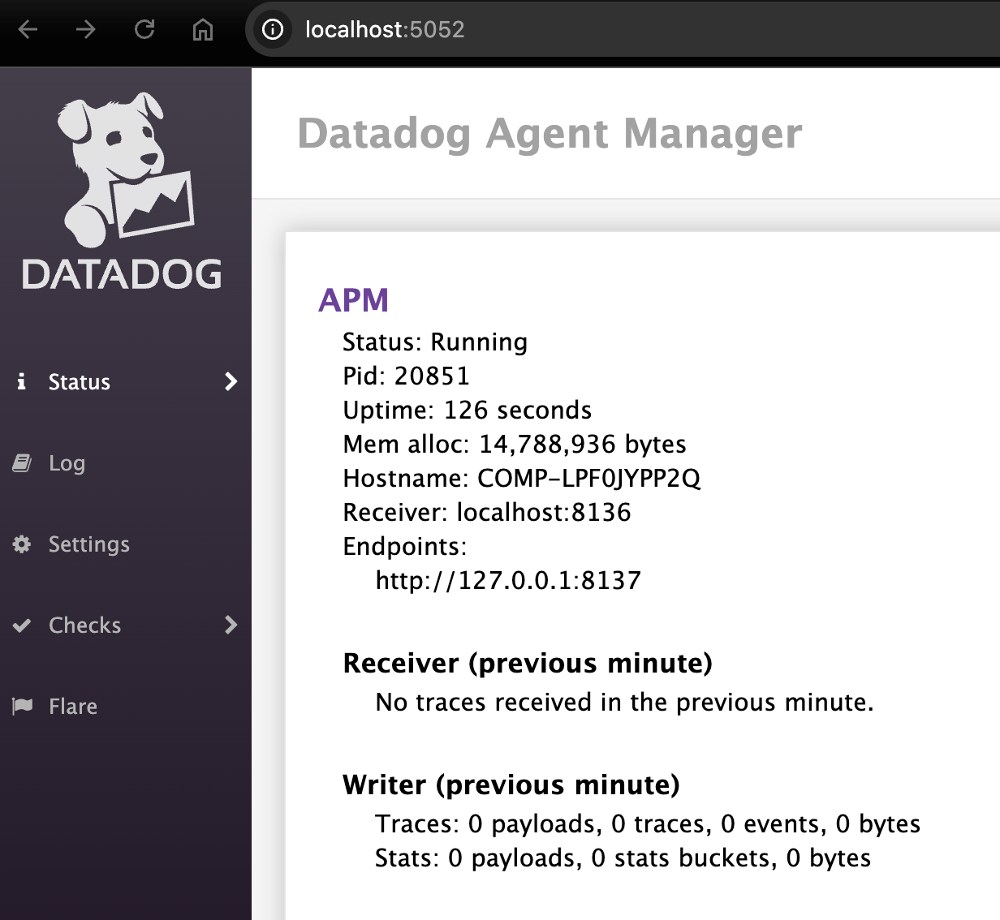

# Setup

Find your Datadog Agent configuration:

```
which datadog-agent
# /usr/local/bin/datadog-agent

ls -ltr /usr/local/bin/datadog-agent
# lrwxr-xr-x 1 root 34 Apr  8 10:33 /usr/local/bin/datadog-agent -> /opt/datadog-agent/bin/agent/agent
# Based on the above it is located at: /opt/datadog-agent/etc/datadog.yaml
# Replace it:
mv /opt/datadog-agent/etc/datadog.yaml /opt/datadog-agent/etc/datadog.yaml.backup
mv ./datadog.yaml /opt/datadog-agent/etc/datadog.yaml
```

Monitor the agent:

```shell
datadog-agent launch-gui
```

Agent Status:



Start a Vector instance:

```shell
vector --config ./agent.yaml
```

Generate traces periodically:

```shell
pip install ddtrace
chmod +x ./gen_traces.py
python ./gen_traces.py
```

# Example

Vector log:

```text
2025-04-28T15:42:12.568684Z DEBUG http: vector::internal_events::http_client: Sending HTTP request. uri=https://trace.agent.datadoghq.com/api/v0.2/stats method=POST version=HTTP/1.1 headers={"content-encoding": "gzip", "content-type": "application/msgpack", "dd-api-key": "REDACTED_MY_DD_API_KEY", "user-agent": "Vector/0.47.0-custom-1e7da76fc (aarch64-apple-darwin debug=full)", "accept-encoding": "identity"} body=[415 bytes]
2025-04-28T15:42:12.568822Z TRACE http: hyper::client::pool: take? ("https", trace.agent.datadoghq.com): expiration = Some(90s)
2025-04-28T15:42:12.568851Z DEBUG http: hyper::client::pool: reuse idle connection for ("https", trace.agent.datadoghq.com)
2025-04-28T15:42:12.568958Z TRACE encode_headers: hyper::proto::h1::role: Client::encode method=POST, body=Some(Known(415))
2025-04-28T15:42:12.569003Z TRACE hyper::proto::h1::io: buffer.flatten self.len=297 buf.len=415
2025-04-28T15:42:12.569102Z DEBUG hyper::proto::h1::io: flushed 712 bytes
2025-04-28T15:42:12.569114Z TRACE hyper::proto::h1::conn: flushed({role=client}): State { reading: Init, writing: KeepAlive, keep_alive: Busy }
```

Sample trace produced:

```json
{
  "agent_version": "7.64.2",
  "app_version": "",
  "container_id": "",
  "dropped": false,
  "env": "none",
  "error_tps": 10.0,
  "host": "COMP-LPF0JYPP2Q",
  "language_name": "python",
  "language_version": "3.13.2",
  "origin": "",
  "payload_version": "v2",
  "priority": 1,
  "runtime_id": "",
  "source_type": "datadog_agent",
  "spans": [
    {
      "duration": 143000,
      "error": 0,
      "meta": {
        "_dd.base_service": "dd_agent_experiments",
        "_dd.p.dm": "-1",
        "_dd.p.tid": "680fa1cb00000000",
        "env": "local",
        "language": "python",
        "runtime-id": "82717a8737724f0386a63c600b97fa9a"
      },
      "meta_struct": {},
      "metrics": {
        "_dd.agent_psr": 1.0,
        "_dd.top_level": 1.0,
        "_dd.tracer_kr": 1.0,
        "_sampling_priority_v1": 1.0,
        "_top_level": 1.0,
        "process_id": 21657.0
      },
      "name": "fake.span",
      "parent_id": 0,
      "resource": "GET /example",
      "service": "pront",
      "span_id": 3219334290885736623,
      "start": "2025-04-28T15:42:03.831632Z",
      "trace_id": -3530690826213928959,
      "type": ""
    }
  ],
  "tags": {
    "_dd.p.dm": "-1"
  },
  "target_tps": 10.0,
  "tracer_version": "3.5.1"
}
```

